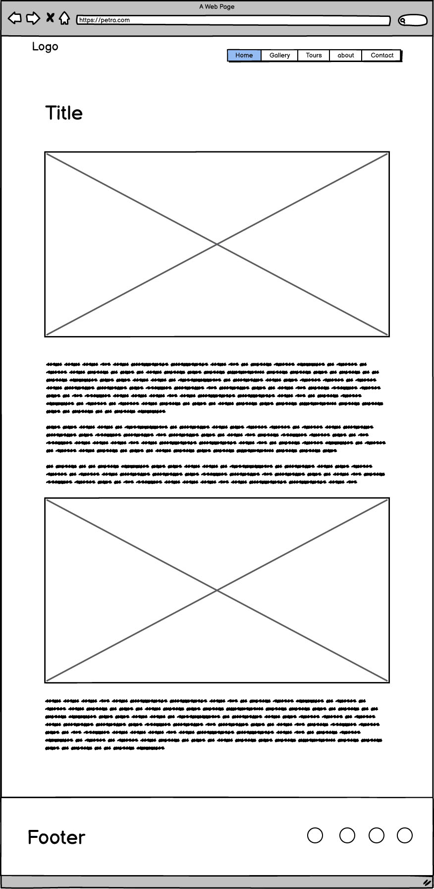

# PETRA Website

The Petra website is designed to be a responsive website allowing visitors to view it on a range of devices. It allows visitors to find information about the ancient city of Petra.

[View Petra on Github Pages](https://ahmadalmasridev.github.io/petra/)

---

## CONTENTS

- [PETRA Website](#petra-website)
  - [CONTENTS](#contents)
  - [**User Experience (UX)**](#user-experience-ux)
    - [**Initial Discussion**](#initial-discussion)
    - [**User Stories**](#user-stories)
  - [**Design**](#design)
    - [**Color Scheme**](#color-scheme)
    - [**Typography**](#typography)
    - [**Imagery**](#imagery)
    - [**Features**](#features)
    - [General features on each page](#general-features-on-each-page)
    - [Accessibility](#accessibility)
  - [Technologies Used](#technologies-used)
    - [Languages Used](#languages-used)
    - [Frameworks, Libraries \& Programs Used](#frameworks-libraries--programs-used)
  - [Deployment \& Local Development](#deployment--local-development)
    - [Deployment](#deployment)
    - [Local Development](#local-development)
      - [How to Fork](#how-to-fork)
      - [How to Clone](#how-to-clone)
  - [Testing](#testing)
  - [Credits](#credits)
    - [Code Used](#code-used)
    - [Content](#content)
    - [ Media](#media)
    - [ Acknowledgments](#acknowledgments)

---

## **User Experience (UX)**

 

### **Initial Discussion**

The Petra website is an information portal about the ancient city and the beautiful scenery inside and around it, the visitor can go through the various articles and photos so that they can get a rough idea of what they can expect when they visit Petra.

Key information for the site

- Articles regarding Petra.
- Photos of various parts of the city.
- A virtual tour video.
- A form to contact and ask questions.
- A couple of good tours from [TripAdvisor](https://www.tripadvisor.com).
- A way to check our social media pages.

### **User Stories**

 **Visitor Goals**

- To be able to view the site on a range of device sizes.
- To be able to navigate through the website with ease.
- To be able to ask questions through the website.
- To provide the user with relevant information regarding Petra.
  
**First Time Visitor Goals**

- I want to know what is Petra and where is it.
- I want to see some photos of the city.
- I want to see videos that contains scenes from Petra.
- I want to ask some questions.
- I want to check there social media.

**Returning Visitor Goals**

- I want to be able to easily ask questions.
- I want to check the latest tours in the city.
- I want to check the virtual tour video.

---

## **Design**

 

The initial design was inspired by two websites templates online,
I have credited these in the [credits](#credits) section.

### **Color Scheme**

The website uses a palette of earth sand colors that can be seen in the rocky mountains in Petra, The color palette was created using the [Coolors](https://coolors.co) website.

### **Typography**

Google Fonts was used for the following fonts:

Fraunces is used for headings on the site.

Inter is used for the body text on the site.

### **Imagery**

The images used are royalty free images downloaded from two photobanks, and the video is from YouTube. I have credited these in the [credits](#credits) section.

Wireframes were created with [Balsamiq](https://balsamiq.com) Wireframes program.

Home Page Wireframe 

Contact Page Wireframe 

Photo Page Wireframe 

 

### **Features**

The website is a single page design with five sections, four of which are accessible from the navigation menu (home, gallery, about, tours & contact pages). The fifth page is a contact form page which is shown once a user clicks the contact navigation button or through contact us button at the end of the home page.
And also has two separate pages (article and photo pages) these pages are accessible once the user clicks a photo from the gallery or an article from the about sections.

Index Page Preview

- All Pages on the website have:

  - A responsive navigation bar at the top which allows the user to navigate through the site. To the left of the navigation bar is a logo. To the right is the navigation bar with the links to the websites pages (home, gallery, about, tours, and contact). To allow a good user experience of the site. When viewing with mobile devices the navigation links change to a vertical list. This was implemented to give the site a clean look and to promote a good user experience. There is also a go to top button that appears in all the pages (except the contact page) once you start scrolling the website and other UI interaction elements like buttons, links and images.

    

    
Navigation Bar

    

    

    

    
Buttons And Captions Hover Effect

      

    

  
  - A footer (except the photo page) which contains social media icon links to Facebook, Twitter, YouTube, and Instagram. Icons were used to keep the footer clean and because they are universally recognizable.

    

    
Social Media Links

    

    

- Home Page.
  
  The home page consist of five sections:

  - **The Hero Section**  
        it contains a preview of the main article with a button that links to that article and also through clicking the hero image.

    

    
Hero Section Preview

    

    

        
     

  - **The Gallery Section**  
        contains a virtual video tour and a photo gallery.

    

    
Gallery Section Preview

    

    

    

  - **The About Section**  
        contains a number of articles and information about the city. Each article is linked to a separate html page.

    

    
About Section Preview

    

    

  - **The Contact Us Section**  
        contains a button that is linked to the contact html page.

    

    
Contact Us Section Preview

    

    

  - **The Tours Section**  
        contains a number of [TripAdvisor](https://www.tripadvisor.com) tours. each element functions as an external link that opens in a new page.

    

    
Contact Tours Preview

    

    

- Article Page.

    Each page contains an article with a couple of images.

    

    
Article Page Preview

    

    

- Contact Page.

    The contact page contains a form that allows the visitor to ask question and send messages. And also gives another way to contact through email.

    

    
Contact Page Preview

    

    

- Photo Page.

    The photo page plays of a black canvas to the photos, also contains a button that returns the visitor back to the gallery.

    

    
Photo Page Preview

    

    

### General features on each page

- The website is designed to be user friendly and all the pages are responsive. The visitor can use it with a variety of screen sizes and resolutions.
the breaking points used, are from this [article](https://testsigma.com/blog/css-breakpoints/#What_are_common_breakpoints).

    Responsivenes:

  - 

    
992px Preview

    

    

  - 

    
768px Preview

    

    

  - 

    
480px Preview

    

    

- When the user hovers on an image a captions appears with information about the image. each image when clicked is a link to a separate html page. This photo gallery was made using flexbox following the information from these articles:
  
  - [article](https://blog.logrocket.com/responsive-image-gallery-css-flexbox/)  
  - [article](https://css-tricks.com/snippets/css/a-guide-to-flexbox/)  

    

    
Gallery Captions

    

    

- The layout for the about and the tours was made using css grid. It is also responsive, and was accomplished by the help from this [article](https://css-tricks.com/snippets/css/complete-guide-grid/)

- The images has a zoom hover effect similer to the one that was used in the love running project by [code institute](https://codeinstitute.net/).

    

    
Images Hover Effect

    

    

- The outline in the input fields change color when focused.

    

    
Input Outline

    

    

- The website dos not have a fixed header. Instead a go to top button is used with smooth scrolling inspired from this [article](https://levelup.gitconnected.com/how-to-implement-scroll-to-top-with-only-css-ae27cb9d4678).

- The embeded video iframe responsiveness was accomplished by the istructions from this [article](https://www.w3schools.com/howto/howto_css_responsive_iframes.asp)

 

### Accessibility

I have been mindful during coding to ensure that the website is as accessible friendly as possible. I have achieved this by:

- Using semantic HTML.
- Using descriptive alt attributes on images on the site.
- Providing information for screen readers where there are icons used - and no text - such as the review ratings for books & footer icons.
- Ensuring that there is a sufficient color contrast throughout the site.
- Ensuring menus are accessible by marking the current page as current for screen readers.

---

## Technologies Used

 

### Languages Used

- HTML
- CSS

### Frameworks, Libraries & Programs Used

- Balsamiq- Used to create wireframes.

- Git - For version control.

- Github - To save and store the files for the website.

- Google Fonts - To import the fonts used on the website.

- Font Awesome - For the iconography on the website.

- Google Dev Tools - To troubleshoot and test features, solve issues with responsiveness and styling.

- [online-convert](https://www.online-convert.com) To change to webp format.

- [Am I Responsive?](https://ui.dev/amiresponsive) To show the website image on a range of devices.

---

## Deployment & Local Development

### Deployment

Github Pages was used to deploy the live website. The instructions to achieve this are below:

1. Log in (or sign up) to Github.
2. Find the repository for this project, petra.
3. Click on the Settings link.
4. Click on the Pages link in the left hand side navigation bar.
5. In the Source section, choose main from the drop down select branch menu. Select Root from the drop down select folder menu.
6. Click Save. Your live Github Pages site is now deployed at the URL shown.

### Local Development

#### How to Fork

How to Fork
To fork the petra repository:

1. Log in (or sign up) to Github.
2. Go to the repository for this project, AhmadAlmasriDev/petra.
3. Click the Fork button in the top right corner.

#### How to Clone

To clone the petra repository:

1. Log in (or sign up) to GitHub.
2. Go to the repository for this project, AhmadAlmasriDev/petra.
3. Click on the code button, select whether you would like to clone with HTTPS, SSH or GitHub CLI and copy the link shown.
4. Open the terminal in your code editor and change the current working directory to the location you want to use for the cloned directory.
5. Type 'git clone' into the terminal and then paste the link you copied in step 3. Press enter.

---

## Testing

 

Please view [Testing.md](testing.md) for the testing documentation.

---

## Credits

 
### Code Used

- Image zoom hover is similer to the zoom effect in the love running tuturial by [code institute](https://codeinstitute.net)

- [The responsive flexbox gallery](https://blog.logrocket.com/responsive-image-gallery-css-flexbox)

- [Css flexbox](https://css-tricks.com/snippets/css/a-guide-to-flexbox)

- [Css grid](https://css-tricks.com/snippets/css/complete-guide-grid)

- [Go to top button](https://levelup.gitconnected.com/animated-page-scroll-with-html-and-css-only-3788c4e2b853)

- [Responsive iframe](https://www.w3schools.com/howto/howto_css_responsive_iframes.asp)

- Design and colors was inspired by these two websites:
  
  - [Trips](https://preview.colorlib.com/theme/trips)
  - [Vacation](https://vacationtemplate.webflow.io)

### Content

- [The lost city article](https://youwannatravel.com/en/41-curiosity/58-petra-the-lost-city)
- [Facts about Petra article](https://www.traveltalktours.com/13-exciting-facts-petra-jordan)
- [Wadi Musa article](https://www.touristjordan.com/wadi-musa)
- [Wadi Rum article](https://whc.unesco.org/en/list/1377)

###  Media

- [AirPanoVR video](https://www.youtube.com/watch?v=xSiv4TkfSOE&t=301s&ab_channel=AirPanoVR)
  
- Photo bank:

  - [Unsplash](https://unsplash.com)
  - [Pexels](https://www.pexels.com)
  
###  Acknowledgments

A blueprint and an example for this README and testing files  was provided by [kera-cudmore](https://github.com/kera-cudmore) from [code institute](https://codeinstitute.net/)
