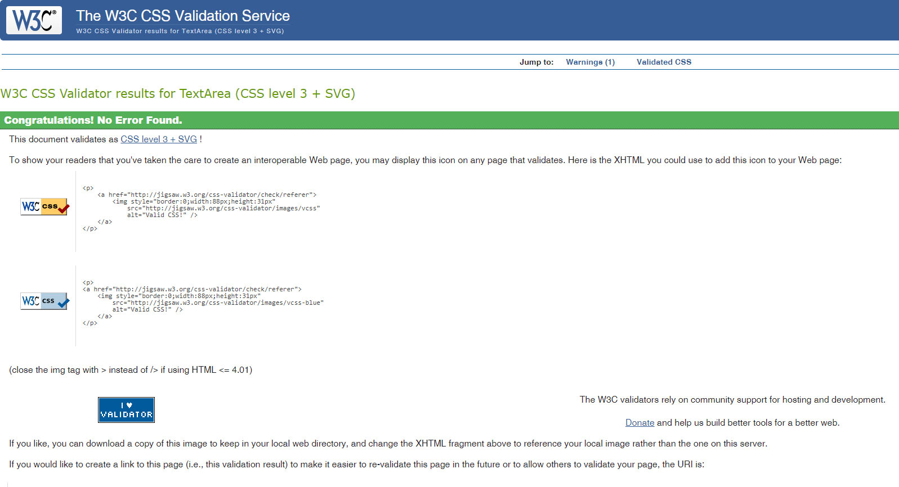
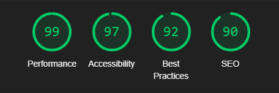
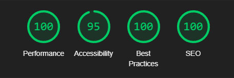
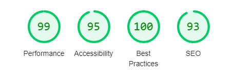
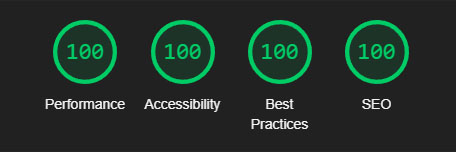
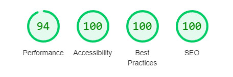

# Testing

Visit the deployed site: [Petra](https://ahmadalmasridev.github.io/petra)

- - -

## CONTENTS

- [Testing](#testing)
  - [CONTENTS](#contents)
  - [AUTOMATED TESTING](#automated-testing)
    - [W3C Validator](#w3c-validator)
    - [Lighthouse](#lighthouse)
    - [Results](#results)
  - [MANUAL TESTING](#manual-testing)
    - [Testing User Stories](#testing-user-stories)
    - [Full Testing](#full-testing)
    - [Known Bugs](#known-bugs)
    - [Solved Bugs](#solved-bugs)

Testing was ongoing throughout the entire build. I utilised Chrome developer tools whilst building to pinpoint and troubleshoot any issues as I went along.

During development I made use of google developer tools to ensure everything was working correctly and to assist with troubleshooting when things were not working as expected.

I have gone through each page using google chrome developer tools to ensure that each page is responsive on a variety of different screen sizes and devices.

I have also used W3 Validator to check the HMTL & CSS.
- - -

## AUTOMATED TESTING

### W3C Validator

[W3C](https://validator.w3.org/) was used to validate the HTML on all pages of the website. It was also used to validate the CSS.

Index Page

Contact Page

        

Photo Page

        

Style.css

        

- - -

### Lighthouse

I used Lighthouse within the Chrome Developer Tools to test the performance, accessibility, best practices and SEO of the website.

Overall, the lighthouse scores are very good, with one or two things that could be improved. To acieve better scores I converted all images to the webp format.

### Results

Index Page

Desktop

Mobile

Contact Page

Desktop

Mobile

Photo Page

Desktop

Mobile

- - -

## MANUAL TESTING
<!-- ### **User Stories**
 **Visitor Goals**
  - To be able to view the site on a range of device sizes.
  - To be able to navigate through the website with ease.
  - To be able to ask questions through the website.
  - To provide the user with relevant information regarding Petra.
  
**First Time Visitor Goals**
  - I want to know what is Petra and where is it.
  - I want to see some photos of the city.
  - I want to see videos that contains scenes from Petra.
  - I want to ask some questions.
  - i want to check there social media.

**Returning Visitor Goals**
  - I want to be able to easily ask questions.
  - I want to check the latest tours in the city.
  - I want to check the virtual tour video. -->

### Testing User Stories

`Visitor Goals`

| Goals | How are they achieved? | Links & Images |
| :--- | :--- | :--- |
|To provide the user with relevant information regarding Petra.| By providing the visitor with a variety of articles and multimedia that can be found in the about, and gallery sections|[About Sections](documentation/section-about.jpg), [Gallery Sections](documentation/section-video.jpg)
|To be able to view the site on a range of device sizes.| By using multiple break point for common used devices and impleminting UI responsiveness css rules|[992px](documentation/respons-992.png), [768px](documentation/respons-768.png), [480px](documentation/respons-480.png)
|To be able to navigate through the website with ease.| By using a navigation bar on the toop of the page with UI interractions and a go to top button that appears whin the visitor start scrolling down| [Navigation Bar](documentation/gif-nav.gif)
|To be able to ask questions through the website.| By using a seperate form page for sending messages and questions, or through the email provided.| [Contact Page](documentation/page-contact.jpg)

`First Time Visitor Goals`

| Goals | How are they achieved? | Images |
| :--- | :--- | :--- |
|I want to know what is Petra and where is it.| By providing the visitor with a variety of articles and multimedia that can be found in the about, and gallery sections|[About Sections](documentation/section-about.jpg), [Gallery Sections](documentation/section-video.jpg)
|I want to see some photos of the city.| By providing a photo gallery section|[Gallery Sections](documentation/section-photo-gallery.jpg)
|I want to see videos that contains scenes from Petra| By providing the visitor with a VR video tour in the gallery section|[Video Tour](documentation/section-video.jpg)
|I want to ask some questions.| By using a seperate form page for sending messages and questions, or through the email provided.| [Contact Page](documentation/page-contact.jpg)
|i want to check there social media.| By providing a social media links in the footer| Social Media](documentation/gif-media.gif)

`Returning Visitor Goals`

| Goals | How are they achieved? | Images |
| :--- | :--- | :--- |
|I want to be able to easily ask questions.| By using a seperate form page for sending messages and questions, or through the email provided.| [Contact Page](documentation/page-contact.jpg)
|I want to check the latest tours in the city.| By providing tours section with the latest tours from [tripaviser](https://www.tripadvisor.com/)| [Tours Section](documentation/section-tours-footer.jpg)
|I want to check the virtual tour video.| By providing the visitor with a VR video tour in the gallery section|[Video Tour](documentation/section-video.jpg)
- - -

### Full Testing

Full testing was performed on the following devices, and additional testing for other devices was carried out using developer tools:

windows laptop, ultrawide 20" monitor, 16:9 24" monitor, 16:9 17" monitor. 

Each device tested the site using the following browsers:

Google Chrome on Windows, Edge

`Index Page`

| Feature | Expected Outcome | Testing Performed | Result | Pass/Fail |
| --- | --- | --- | --- | --- |
| **NAVBAR** |  |  |  |  |
|  |  |  |  |  |
| Logo image link | When clicked you are redirected to the home page | Clicked Logo | Redirected to home page | Pass|
| Navbar home link | When clicked you are redirected to the home page | Clicked link | Redirected to home page | Pass |
| Navbar home link - Hover | When hovered over converts to a red button wit white font | Hovered over link | converted to a red button with white font | Pass |
| Navbar gallery link | When clicked you are redirected to the gallery section | Clicked link | Redirected to gallery section | Pass |
| Navbar gallery link - Hover | When hovered over converts to a red button wit white font | Hovered over link | converted to a red button with white font | Pass |
| Navbar about link | When clicked you are redirected to the about section | Clicked link | Redirected to about section | Pass |
| Navbar about link - Hover | When hovered over converts to a red button wit white font | Hovered over link | converted to a red button with white font | Pass |
| Navbar tours link | When clicked you are redirected to the tours section | Clicked link | Redirected to tours section | Pass |
| Navbar tours link - Hover | When hovered over converts to a red button wit white font | Hovered over link | converted to a red button with white font | Pass |
| Navbar contact link | When clicked you are redirected to the contact page | Clicked link | Redirected to contact page | Pass |
| Navbar contact link - Hover | When hovered over converts to a red button wit white font | Hovered over link | converted to a red button with white font | Pass |
| **HERO SECTION** |  |  |  |  |
|  |  |  |  |  |
| more info button | Directs to main article page | Clicked button | Directed to main article page | Pass |
| more info button - Hover | When hovered over back ground color change to dark orange | Hovered over button | back ground color changed to dark orange | Pass |
| hero image link | Directs to main article page | Clicked button | Directed to main article page | Pass |
| hero image link - Hover | When hovered on trigers a zoom effect | Hovered over image | trigersd a zoom effect | Pass |
| **GALLERY SECTION** |  |  |  |  |
|  |  |  |  |  |
| gallery video tour | Starts the video when click play button| Clicked play button| Started the video | Pass |
| photo gallery images | Directs to a seperate photo page| Clicked image | Directed to seperate phot page | Pass |
| photo gallery images - Hover | When hovered on trigers an overlay effect wit text info | Hovered over image | trigered an overlay effect wit text info | Pass |
| **ABOUT SECTION** |  |  |  |  |
|  |  |  |  |  |
| article images | Directs to the article page| Clicked image | Directed to the article page | Pass |
| article images - Hover | When hovered on trigers a zoom effect | Hovered over image | trigersd a zoom effect | Pass |
| images captions | Directs to the article page| Clicked image | Directed to the article page | Pass |
| images captions - Hover | When hovered changes font color to dark orange | Hovered over image caption | changed font color to dark orange | Pass |
| **CONTACT SECTION** |  |  |  |  |
|  |  |  |  |  |
| contact us button | Directs to the contact page | Clicked button | Directed to the contact page  | Pass |
| contact us button - Hover | When hovered over back ground color change to dark orange | Hovered over button | back ground color changed to dark orange | Pass |
| **TOURS SECTION** |  |  |  |  |
|  |  |  |  |  |
| tour images | Directs to a targeted external page| Clicked image | Directed to the targeted external page | Pass |
| tour images - Hover | When hovered on trigers a zoom effect | Hovered over image | trigersd a zoom effect | Pass |
| images captions | Directs to a targeted external page| Clicked image | Directed to a targeted external page | Pass |
| images captions - Hover | When hovered changes font color to dark orange | Hovered over image caption | changed font color to dark orange | Pass |
| **FOOTER** |  |  |  |  |
|  |  |  |  |  |
| facebook button | Directs to facebook page | Clicked button | Directed to facebook  page | Pass |
| facebook button - Hover | When hovered over font color change to dark orange | Hovered over button | font color changed to dark orange | Pass |
| twitter button | Directs to twitter page | Clicked button | Directed to twitter page | Pass |
| twitter button - Hover | When hovered over font color change to dark orange | Hovered over button | font color changed to dark orange | Pass |
| youtube button | Directs to youtube page | Clicked button | Directed to youtube page | Pass |
| youtube button- Hover | When hovered over font color change to dark orange | Hovered over button | font color changed to dark orange | Pass |
| instagram button | Directs to instagram page | Clicked button | Directed to instagram page | Pass |
| instagram button - Hover | When hovered over font color change to dark orange | Hovered over button | font color changed to dark orange | Pass |
| to top button | Directs to the top of the page | Clicked button | Directed to the top of the page  | Pass |
| to top button - Hover | When hovered over back ground color change to dark orange | Hovered over button | back ground color changed to dark orange | Pass |

---

`Article Page`

| Feature | Expected Outcome | Testing Performed | Result | Pass/Fail |
| --- | --- | --- | --- | --- |
| **NAVBAR** |  |  |  |  |
|  |  |  |  |  |
| Logo image link | When clicked you are redirected to the home page | Clicked Logo | Redirected to home page | Pass|
| Navbar home link | When clicked you are redirected to the home page | Clicked link | Redirected to home page | Pass |
| Navbar home link - Hover | When hovered over converts to a red button wit white font | Hovered over link | converted to a red button with white font | Pass |
| Navbar gallery link | When clicked you are redirected to the gallery section | Clicked link | Redirected to gallery section | Pass |
| Navbar gallery link - Hover | When hovered over converts to a red button wit white font | Hovered over link | converted to a red button with white font | Pass |
| Navbar about link | When clicked you are redirected to the about section | Clicked link | Redirected to about section | Pass |
| Navbar about link - Hover | When hovered over converts to a red button wit white font | Hovered over link | converted to a red button with white font | Pass |
| Navbar tours link | When clicked you are redirected to the tours section | Clicked link | Redirected to tours section | Pass |
| Navbar tours link - Hover | When hovered over converts to a red button wit white font | Hovered over link | converted to a red button with white font | Pass |
| Navbar contact link | When clicked you are redirected to the contact page | Clicked link | Redirected to contact page | Pass |
| Navbar contact link - Hover | When hovered over converts to a red button wit white font | Hovered over link | converted to a red button with white font | Pass |
| to top button | Directs to the top of the page | Clicked button | Directed to the top of the page  | Pass |
| to top button - Hover | When hovered over back ground color change to dark orange | Hovered over button | back ground color changed to dark orange | Pass |
| **FOOTER** |  |  |  |  |
|  |  |  |  |  |
| facebook button | Directs to facebook page | Clicked button | Directed to facebook  page | Pass |
| facebook button - Hover | When hovered over font color change to dark orange | Hovered over button | font color changed to dark orange | Pass |
| twitter button | Directs to twitter page | Clicked button | Directed to twitter page | Pass |
| twitter button - Hover | When hovered over font color change to dark orange | Hovered over button | font color changed to dark orange | Pass |
| youtube button | Directs to youtube page | Clicked button | Directed to youtube page | Pass |
| youtube button- Hover | When hovered over font color change to dark orange | Hovered over button | font color changed to dark orange | Pass |
| instagram button | Directs to instagram page | Clicked button | Directed to instagram page | Pass |
| instagram button - Hover | When hovered over font color change to dark orange | Hovered over button | font color changed to dark orange | Pass |
| to top button | Directs to the top of the page | Clicked button | Directed to the top of the page  | Pass |
| to top button - Hover | When hovered over back ground color change to dark orange | Hovered over button | back ground color changed to dark orange | Pass |

--- 

`Photo Page`

| Feature | Expected Outcome | Testing Performed | Result | Pass/Fail |
| --- | --- | --- | --- | --- |
| back to gallery button | Directs to the photo gallery in home page | Clicked button | Directed to the photo gallery in home page | Pass |
| back to gallery - Hover | When hovered over back ground color change to dark orange | Hovered over button | back ground color changed to dark orange | Pass |

---

### Known Bugs

| Known Bug No | Bug Issue | Plan to Resolve |
| :--- | :--- | :--- |
| 1 |  photo page the black background does not cover the whole scrren when change orientation and scroll | try ohter methods than absolute location|

### Solved Bugs

| Bug No | Bug Issue | How Resolved |
| :--- | :--- | :--- |
| 1 | frameborder iframe proportiy from youtube embeded video gives a depricated proprtiy warning in html validator | deleted the proporty and used css instead|

Back to [README.md](README.md)